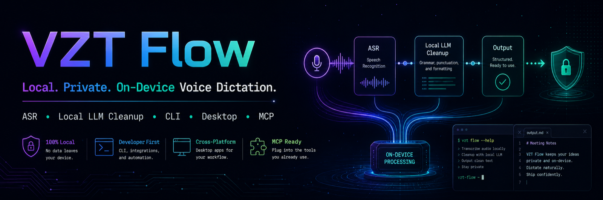
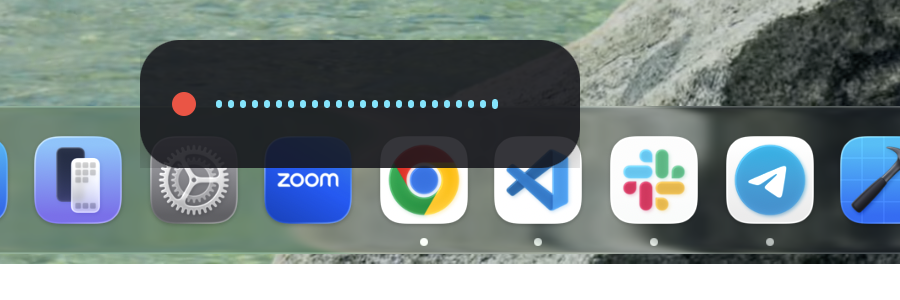

<p align="center"></p>

# VZT Flow

[](https://github.com/vonzelle-vzt/vzt-flow/actions/workflows/build.yml)
[](https://github.com/vonzelle-vzt/vzt-flow/releases)
[](LICENSE)


Hold a key, talk, and the transcript lands wherever your cursor is — no
subscription, no word limits, and nothing but the model *downloads* ever
touch the network. Hold-to-talk (or tap for hands-free) → local ASR
(Parakeet TDT) → optional local LLM cleanup (Qwen3) → paste. Also works
headless as a CLI and as an MCP voice-input tool for
[Claude Code](https://claude.com/claude-code).

## Why

Cloud dictation apps like [Wispr Flow](https://wisprflow.ai) are good
products, but they cost **$12-15/month**, and every recording — audio,
sometimes screenshots for app-aware formatting — leaves your machine and is
processed on someone else's servers. VZT Flow exists because none of that is
actually necessary for a hold-key-and-talk workflow on Apple Silicon: a
0.6B-parameter ASR model and a 1.7B cleanup LLM both run comfortably local,
fast enough that the round trip to the cloud was never buying you much.

|  | VZT Flow | Cloud dictation apps |
|---|---|---|
| Cost | $0, forever | $12-15/mo subscription |
| Where transcription happens | 100% on-device (ONNX + Metal / CoreML) | Cloud |
| Audio/screenshots leave your machine | Never | Sent to their servers |
| Word/usage limits | None | Plan-dependent |
| Per-app behavior | Bundle-id profiles (`profiles.toml`), editable | Limited, closed |
| Code mode (identifiers, symbols, no LLM rewrite) | Yes, deterministic | No |
| Custom dictionary (names, jargon, spellings) | Yes, local file | Varies |
| Text snippets/expansion | Yes, local file | Limited |
| CLI | Yes (`flow listen`, `flow transcribe`, `flow doctor`, ...) | No |
| Scriptable / MCP voice input for agents | Yes (`listen`, `transcribe_file`, `dictation_history`) | No |
| Source | Open, MIT | Closed |

This isn't a claim that VZT Flow's transcription quality beats a
cloud-scale model — Parakeet TDT 0.6B is very good, not the biggest ASR
model in existence. The trade being made deliberately is: give up a little
headroom at the top end in exchange for zero cost, zero network dependency,
and a hard privacy guarantee you can verify yourself by reading the source.

## Feature tour

### Push-to-talk, hands-free, and cancel

**Hold Right Option** to record — release to transcribe and paste. **Tap**
it (press+release faster than the 300ms hold threshold) to start a
**hands-free** recording instead, which auto-stops after ~2.5s of
continuous silence following at least one loud frame, or stops on a second
tap. **Esc** cancels an in-progress recording outright — nothing is
transcribed or pasted. Every recording mode is hard-capped (120s held, 300s
hands-free) so a stuck key can never record forever; hitting the cap
transcribes what was captured rather than discarding it.

A small floating pill overlay tracks the whole lifecycle: a live level
meter while **Recording**, a mode badge (raw/clean/polish/code) while
**Transcribing**, a brief **Done** flash, and short-lived **Message** states
for non-fatal issues ("Secure field — transcript on clipboard", "No
Accessibility permission", "Microphone disconnected").

### On-device ASR: Parakeet TDT 0.6B v3

Speech-to-text runs through [transcribe-rs](https://github.com/cjpais/transcribe-rs)
on an int8-quantized [NVIDIA Parakeet TDT 0.6B v3](https://huggingface.co/nvidia/parakeet-tdt-0.6b-v3)
ONNX model, with the CoreML execution provider on Apple Silicon. Measured on
this repo's own hardware (M5 MacBook Air, `flow transcribe` on an 8.6s
synthesized clip): **0.83s wall time, RTF 0.097x** — about 10x realtime.
Windows runs the same model on plain CPU ONNX (no CoreML there), so expect a
lower realtime factor. Per NVIDIA's model card, Parakeet TDT v3 covers 25
European languages.

### AI cleanup: on-device Qwen3-1.7B, three modes, a hard deadline

`clean` and `polish` modes run [Qwen3-1.7B-Instruct](https://huggingface.co/Qwen)
(Q4_K_M GGUF, via [unsloth](https://huggingface.co/unsloth)'s
re-quantization) through embedded [llama.cpp](https://github.com/ggml-org/llama.cpp)
with the Metal backend. `clean` (the default) strips filler words, false
starts, and repeats, and fixes grammar/punctuation while preserving your
wording; `polish` restructures the dictation into clear, well-formatted
writing for the target app and tone; `raw` never touches the LLM at all —
Parakeet already punctuates.

Cleanup is **deadline-bound**: `cleanup_timeout_ms` (2500ms default) races
generation on a worker thread against a timer. Measured on this machine,
warm generation for a short sentence lands around **0.3s** — well inside the
deadline — but if the deadline is ever missed, the dictionary-corrected raw
transcript is pasted instead and the worker thread is cooperatively
cancelled and joined (never detached, so a slow generation can't leak a
live Metal context). The pipeline **never blocks indefinitely, and never
silently rewrites you past what you actually said** — worst case you get
your own words back, on time.

### Code mode: deterministic spoken-form → identifiers

`code` mode is a pure, no-LLM transform (`crates/flow-core/src/codemode.rs`)
so it's exact and instant — no model in the loop at all:

| Spoken | Result |
|---|---|
| `camel case user id` | `userId` |
| `snake case api key` | `api_key` |
| `pascal case flow core` | `FlowCore` |
| `kebab case my app` | `my-app` |
| `open paren close paren` | `()` |
| `fat arrow` | `=>` |
| `dollar sign` | `$` |
| `get user open paren close paren` | `getUser()` *(implicit call-name merge)* |
| `console dot log open paren close paren` | `console.log()` |

Language keywords (`const`, `return`, `async`, `if`, `class`, ...) stay
literal and act as boundaries, so full statements dictate cleanly:
`"const camel case user profile equals await get user open paren close
paren"` → `const userProfile = await getUser()`.

### Per-app profiles, computed locally

`profiles.toml` maps macOS bundle IDs (with optional `*` prefix matching) to
a mode/tone pair, resolved from the frontmost app via `NSWorkspace` — no
screenshot, no window content ever inspected, just the bundle identifier.
Terminal, iTerm2, and Warp are seeded to `code` mode out of the box; Mail
gets `clean`/`formal`; Slack gets `clean`/`casual`. Anything else falls back
to `[default]`.

### Personal dictionary + voice snippets

The dictionary (`dictionary.json`) fixes ASR mishearings before cleanup or
code-mode ever see the transcript — fuzzy (edit-distance) matching for terms
4+ characters (`superbase`/`super base` → `Supabase`), exact-match only for
shorter terms so they don't misfire. Snippets (`snippets.json`) expand a
trigger phrase into fixed text when it's the *entire* dictation — say "my
email" or "insert my email" to fire the seeded `vonzelle@vzttechconsulting.com`
expansion, or add your own.

### MCP server for Claude Code — dictate your prompts by voice

This is the headline differentiator: a small MCP server
(`mcp/src/index.ts`) that gives Claude Code a `listen` tool, so you can
dictate a prompt out loud instead of typing it.

```bash
cd mcp && npm install && npm run build
claude mcp add vzt-flow --scope user -- node "$(pwd)/dist/index.js"
```

Once registered, just ask Claude Code to listen for your voice input and it
invokes `listen` directly — no alt-tabbing out to a separate dictation app.
It talks to the running desktop app's daemon socket when available (driving
the same overlay you see everywhere else), falling back to the standalone
`flow` CLI otherwise. Two more tools ship alongside it: `transcribe_file`
(an existing audio file) and `dictation_history` (recent dictations).

### Full CLI + daemon socket

```bash
flow listen --mode clean | pbcopy      # dictate straight to the clipboard
flow transcribe recording.wav          # transcribe an existing file
flow history -n 20                     # recent dictations
flow doctor                            # environment/model/daemon diagnostics
```

`flow` is daemon-first (drives the desktop app's overlay when it's running)
with a fully standalone fallback (capture/transcribe/cleanup, no daemon
required) — see [CLI reference](docs/USAGE-macOS.md#cli-reference) for the
complete command list, including the hidden diagnostic commands
(`paste-test`, `clean-test`, `code-test`).

### Resource discipline

The Parakeet and cleanup models are lazy-loaded on first use and idle-
unloaded after `idle_unload_secs` (300s default) of inactivity, so VZT Flow
doesn't sit holding ~1.5GB of models in memory between dictations. The
packaged `.app` bundle itself measures **36MB** on this build — small enough
that Tauri's native-webview approach (vs. bundling a full Chromium/Electron
runtime) is doing real work here, not just a marketing line.

## Install

### macOS: one-liner

```bash
curl -fsSL https://raw.githubusercontent.com/vonzelle-vzt/vzt-flow/main/scripts/install.sh | bash
```

Downloads the latest GitHub Release, installs `VZT Flow.app` to
`/Applications`, the `flow` CLI to a PATH directory, and registers the MCP
server with `claude mcp add` if the `claude` CLI is present.

### Manual: download from Releases

Grab the `.dmg` (macOS) or `.msi`/`-setup.exe` (Windows) from the
[Releases page](https://github.com/vonzelle-vzt/vzt-flow/releases).

### Build from source

```bash
git clone https://github.com/vonzelle-vzt/vzt-flow.git
cd vzt-flow
cargo build --release -p flow-cli
./target/release/flow doctor
./target/release/flow models download parakeet-v3
cd apps/desktop && npm install && cargo install tauri-cli --version "^2" && cargo tauri build
```

Full prerequisites and platform notes: [docs/USAGE-macOS.md](docs/USAGE-macOS.md#install).

### First run: model downloads

Models are **not** bundled with the app — they download separately and live
under `~/.config/vzt-flow/models/`:

| Model | Purpose | Size |
|---|---|---|
| Parakeet TDT v3 (int8 ONNX) | Speech-to-text (always required) | ~456MB |
| Qwen3-1.7B-Instruct (Q4_K_M GGUF) | Optional `clean`/`polish` LLM rewrite | ~1.1GB |

```bash
flow models download            # parakeet-v3 (the default)
flow models download cleanup    # optional — needed for clean/polish modes
```

Then grant **Microphone**, **Accessibility**, and **Input Monitoring** in
System Settings → Privacy & Security — see
[docs/USAGE-macOS.md#permissions](docs/USAGE-macOS.md#permissions) for exact
steps and **the unsigned-rebuild gotcha**: every `cargo tauri build` mints a
new code signature, and macOS silently revokes Input Monitoring/Accessibility
grants for the previous one. If the hotkey stops working right after a
rebuild, that's almost always why.

### Intel Mac

CI also builds and packages an `x86_64-apple-darwin` `.dmg`/CLI tarball
(`vzt-flow-macos-x86_64-dmg` / `vzt-flow-cli-macos-x86_64.tar.gz`), cross-
compiled from an Apple Silicon runner. CPU-only inference (no Metal/CoreML)
— slower than Apple Silicon, especially for `clean`/`polish` cleanup, but
functionally the same pipeline. `scripts/install.sh` auto-detects Intel vs.
Apple Silicon and grabs the right asset. Never run on real Intel hardware —
see [Hardware requirements](docs/USAGE-macOS.md#hardware-requirements) for
the honest performance estimate and the `ort`-has-no-prebuilt-binaries gap
this build works around.

### Windows (experimental)

> [!WARNING]
> Compiles and is CI-built on every push, but **has never been run on real
> Windows hardware**. No daemon socket, no per-app profiles, no
> `clean`/`polish` cleanup LLM yet, Ctrl+V paste with no secure-field
> detection. Default hotkey is **Ctrl+Shift+Space**.

```powershell
cargo build --release -p flow-cli
.\target\release\flow.exe models download parakeet-v3
cd apps\desktop
npm install
cargo install tauri-cli --version "^2"
cargo tauri build --target x86_64-pc-windows-msvc
```

Every verified difference from macOS is documented in
[docs/USAGE-Windows.md](docs/USAGE-Windows.md). Windows on Arm (`aarch64-pc-windows-msvc`)
is attempted in CI as an allowed-to-fail job — see
[docs/USAGE-Windows.md#hardware-requirements](docs/USAGE-Windows.md#hardware-requirements)
for current status.

## Hardware compat matrix

| Platform | Status | Notes |
|---|---|---|
| macOS Apple Silicon (`aarch64-apple-darwin`) | **Supported, tested** | Primary dev platform (M5 MacBook Air); Metal cleanup + CoreML ASR |
| macOS Intel (`x86_64-apple-darwin`) | Built in CI, CPU-only inference | Never run on real Intel hardware; effective floor is macOS **13.3**, not the 12.0 in `tauri.conf.json` — see [USAGE-macOS.md](docs/USAGE-macOS.md#hardware-requirements) |
| Windows x64 (`x86_64-pc-windows-msvc`) | Built in CI, experimental | Never run on real Windows hardware; no daemon/profiles/cleanup LLM yet |
| Windows Arm (`aarch64-pc-windows-msvc`) | Attempted in CI, allowed to fail | Status depends on upstream (`ort`, WebView2-on-Arm) support this week — check the latest `build` workflow run |
| Linux | Not built, not attempted | No CI job targets it; `cfg(not(target_os = "macos"))` code paths exist but are only exercised by the Windows job |

None of the non-"tested" rows are claimed to work beyond "compiles and
packages in CI" — see each platform's usage doc for what's actually been
verified vs. what's an honest "should work per the code, untested"
statement.

## Screenshots

<p align="center">
  
  <br><em>The overlay pill mid-recording — a live level meter, floating above the Dock.</em>
</p>

*(More UI screenshots — the tray menu and Settings window — are planned; the
menu-bar extra on this multi-monitor dev machine doesn't render reliably
under scripted/synthetic clicks, so they're left out rather than faked. See
[Contributing](#contributing) if you'd like to add them from a
single-display setup.)*

## Architecture

```
 hold-to-talk hotkey (Right Option, or tap for hands-free)
        │
        ▼
   audio capture (cpal) ──► Parakeet TDT v3 (ONNX, int8) ──► raw transcript
                                                                   │
                              dictionary correction (local)  ◄────┘
                                                                   │
                per-app profile: raw | clean | polish | code ◄────┘
                       (code = deterministic; clean/polish = local
                        Qwen3-1.7B via llama.cpp, deadline-bound)
                                                                   │
                          snippet expansion (local)          ◄────┘
                                                                   │
                     clipboard save → set → simulate paste ◄──────┘
                     → restore clipboard after a short delay
```

| Crate/app | Role |
|---|---|
| `crates/flow-core` | The engine: audio capture, ASR, LLM cleanup, dictionary, code mode, snippets, profiles, history, hotkey monitoring, paste, model download/management, daemon IPC. Platform-agnostic; macOS-only pieces are `#[cfg(target_os = "macos")]`-gated. |
| `crates/flow-cli` | The `flow` binary. Daemon-first, standalone fallback. |
| `apps/desktop` | The [Tauri 2](https://tauri.app) menu-bar app: tray icon, overlay, Settings window, hotkey, daemon control socket. |
| `mcp/` | Node/TypeScript MCP server (`listen`, `transcribe_file`, `dictation_history`) for Claude Code. |

Key dependencies: [Tauri 2](https://tauri.app) (native webview shell — an
8-12MB installer footprint instead of bundling Chromium the way Electron
does, which is most of why the packaged app measures 36MB total rather than
150MB+), [transcribe-rs](https://github.com/cjpais/transcribe-rs) (ONNX ASR
runtime), [cpal](https://github.com/RustAudio/cpal) (cross-platform audio
capture), [llama-cpp-2](https://github.com/utilityai/llama-cpp-rs) (Rust
bindings for llama.cpp), [enigo](https://github.com/enigo-rs/enigo)
(cross-platform input simulation for the paste step).

## Configuration quick reference

Persisted at `~/.config/vzt-flow/config.toml` (macOS) / `%APPDATA%\vzt-flow\config.toml`
(Windows). Full field-by-field docs, including which fields apply live vs.
require a restart: [docs/USAGE-macOS.md#config-reference-configtoml](docs/USAGE-macOS.md#config-reference-configtoml).

| Field | Default | Meaning |
|---|---|---|
| `hotkey_keycode` | `61` (Right Option) | Hold-to-talk key |
| `hold_threshold_ms` | `300` | Hold vs. tap threshold (ms) |
| `idle_unload_secs` | `300` | Model idle-unload timer (s) |
| `max_hold_secs` | `120` | Hard cap on a held recording (s) |
| `max_handsfree_secs` | `300` | Hard cap on hands-free recording (s) |
| `cleanup_timeout_ms` | `2500` | LLM cleanup deadline before raw fallback (ms) |
| `handsfree_silence_secs` | `2.5` | Silence before hands-free auto-stops (s) |
| `launch_at_login` | `false` | Mirrors `tauri-plugin-autostart` |

## Roadmap

- Windows daemon socket + per-app profiles + `clean`/`polish` cleanup LLM
  (all currently macOS-only)
- Real-hardware validation on Windows (everything today is CI-built, never
  hand-tested — see [docs/USAGE-Windows.md](docs/USAGE-Windows.md))
- Apple's on-device `SpeechAnalyzer` as an alternate ASR engine option
- Code signing/notarization so permission grants survive rebuilds without
  the manual remove/re-add workaround
- A dedicated "polish for Claude Code" cleanup mode tuned for dictating
  prompts rather than prose

## Contributing

Issues and PRs welcome. The codebase is small enough to read end to end —
start with `crates/flow-core/src/lib.rs` and the module list above. Please
verify claims against the code the way the docs in this repo try to (see
the doc comments throughout `flow-core` for the standard).

## License

MIT — see [LICENSE](LICENSE). Copyright (c) 2026 VZT Tech Consulting.

## Credits

- [transcribe-rs](https://github.com/cjpais/transcribe-rs) / [Handy](https://github.com/cjpais/Handy) (cjpais) — the ONNX transcription plumbing and pre-packaged Parakeet int8 model archive this project uses.
- [NVIDIA Parakeet TDT](https://huggingface.co/nvidia/parakeet-tdt-0.6b-v3) — the local ASR model.
- [Qwen3](https://huggingface.co/Qwen) (via [unsloth](https://huggingface.co/unsloth)'s GGUF re-quantization) — the local cleanup/rewrite LLM.
- [llama.cpp](https://github.com/ggml-org/llama.cpp) / [llama-cpp-2](https://github.com/utilityai/llama-cpp-rs) / [ggml](https://github.com/ggml-org/ggml) — local LLM inference.
- [Silero VAD](https://github.com/snakers4/silero-vad) — voice activity detection informing hands-free auto-stop.
- [Tauri](https://tauri.app) — the desktop app shell.

## FAQ

**Is anything sent to the cloud?** No. Audio, transcripts, and screenshots
never leave your machine. The only network traffic VZT Flow ever makes is
downloading the Parakeet/Qwen3 model files once, from Hugging Face.

**Why is my first dictation slow?** The Parakeet model isn't loaded until
the first recording finishes (lazy load), and is idle-unloaded again after
`idle_unload_secs` of inactivity — expect a few seconds of one-time load
latency on that first dictation only. If you're using `clean`/`polish`, the
cleanup LLM pre-warms (model load + a throwaway generation to force Metal
kernel JIT compilation) as soon as a recording *starts*, in parallel with
you talking, so it's typically already warm by the time you finish speaking.

**Does it work offline?** Yes, fully, once the models are downloaded.

**Apple Silicon only?** No — Intel Macs (`x86_64-apple-darwin`) are also
built in CI (CPU-only inference, no Metal/CoreML; never run on real Intel
hardware — see [Hardware compat matrix](#hardware-compat-matrix)). Windows
builds target `x86_64-pc-windows-msvc`, with `aarch64-pc-windows-msvc`
attempted as an allowed-to-fail CI job.
